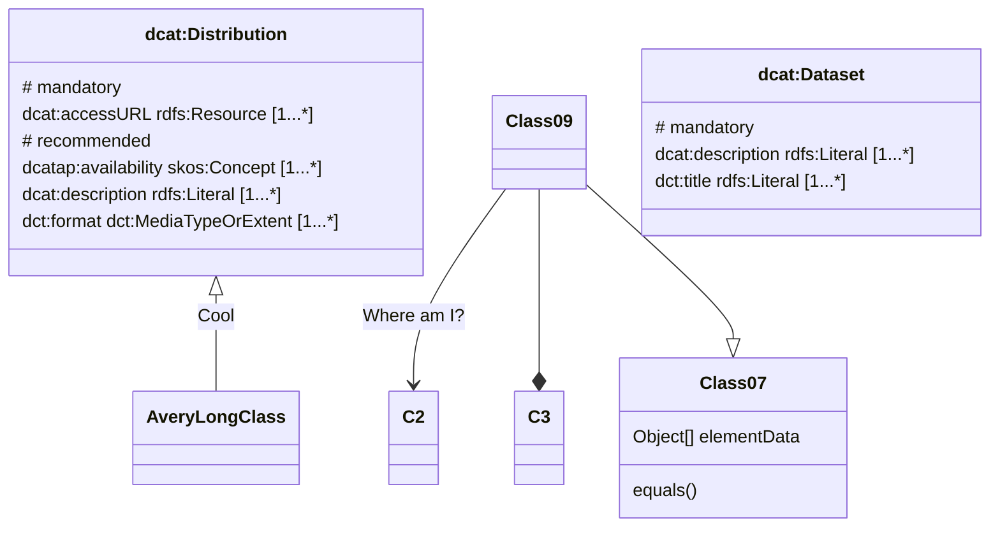

```mermaid
classDiagram
`dcat:Distribution` <|-- AveryLongClass : Cool
Class09 --> C2 : Where am I?
Class09 --* C3
Class09 --|> Class07
Class07 : equals()
Class07 : Object[] elementData
`dcat:Distribution` : # mandatory
`dcat:Distribution` : dcat#58;accessURL rdfs#58;Resource [1...*]
`dcat:Distribution` : # recommended
`dcat:Distribution` : dcatap#58;availability skos#58;Concept [1...*]
`dcat:Distribution` : dcat#58;description rdfs#58;Literal [1...*]
`dcat:Distribution` : dct#58;format dct#58;MediaTypeOrExtent [1...*]
class `dcat:Dataset` {
  # mandatory
  dcat#58;description rdfs#58;Literal [1...*]
  dct#58;title rdfs#58;Literal [1...*]
}
```
